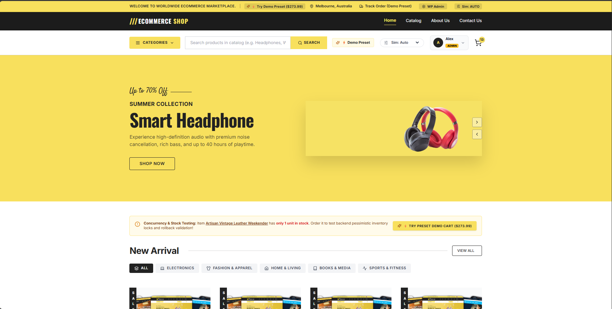
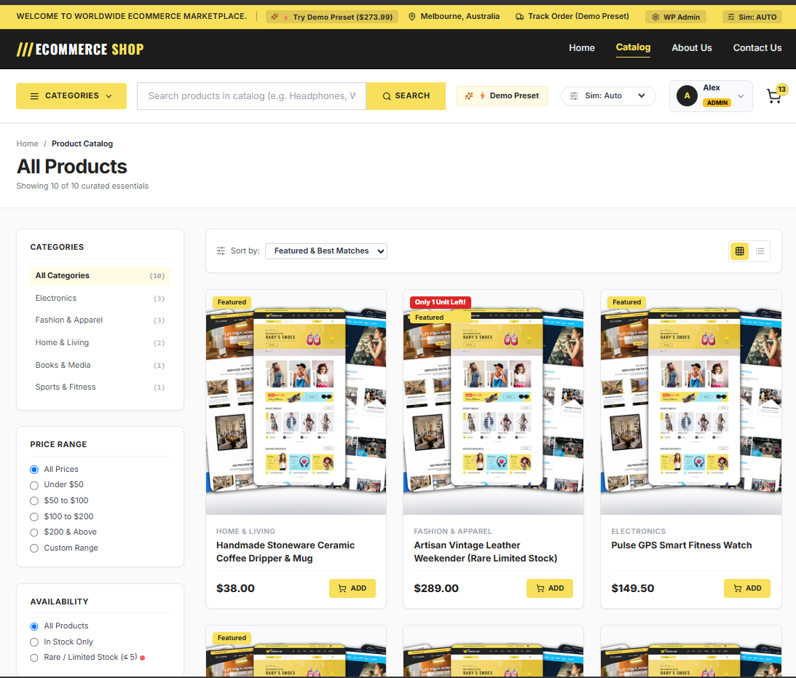
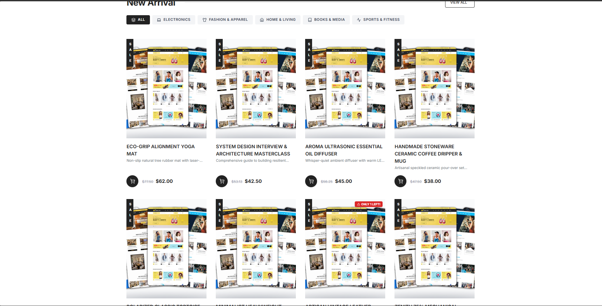
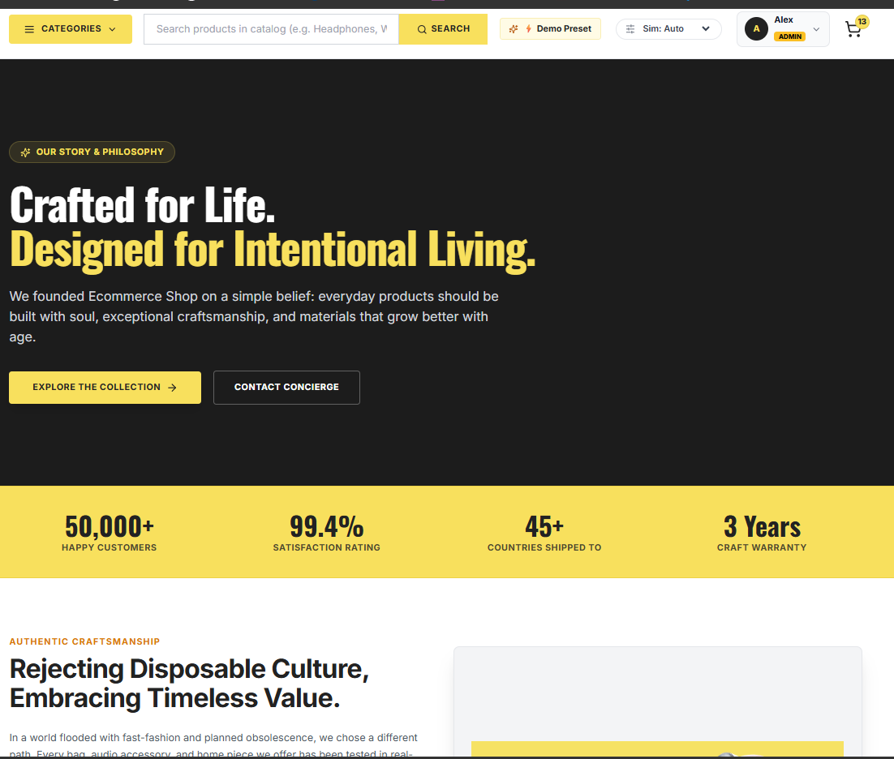
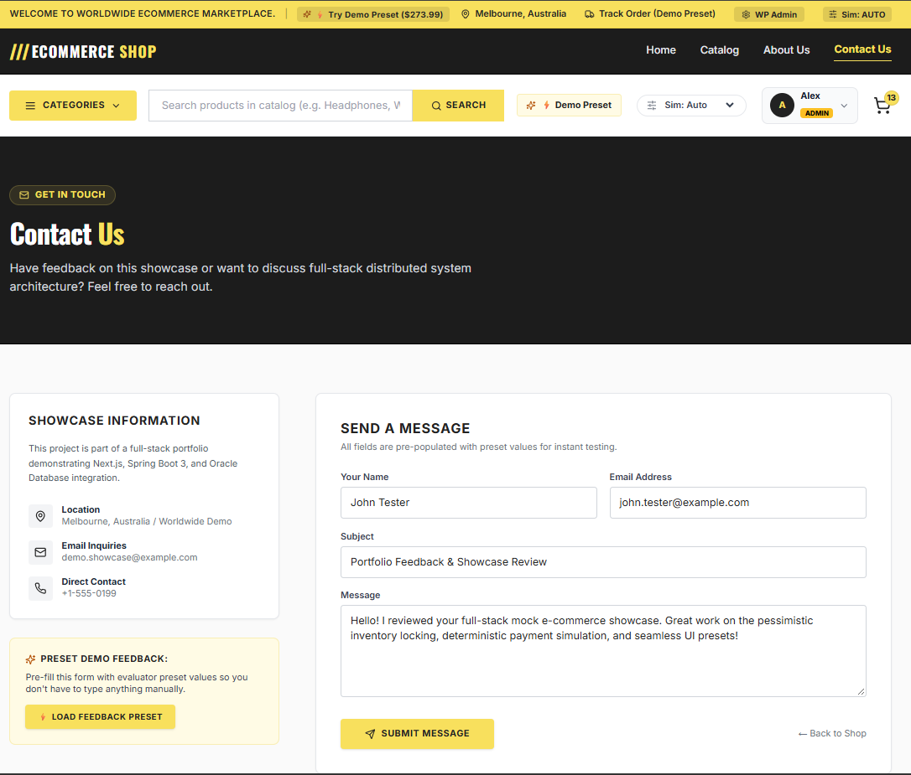
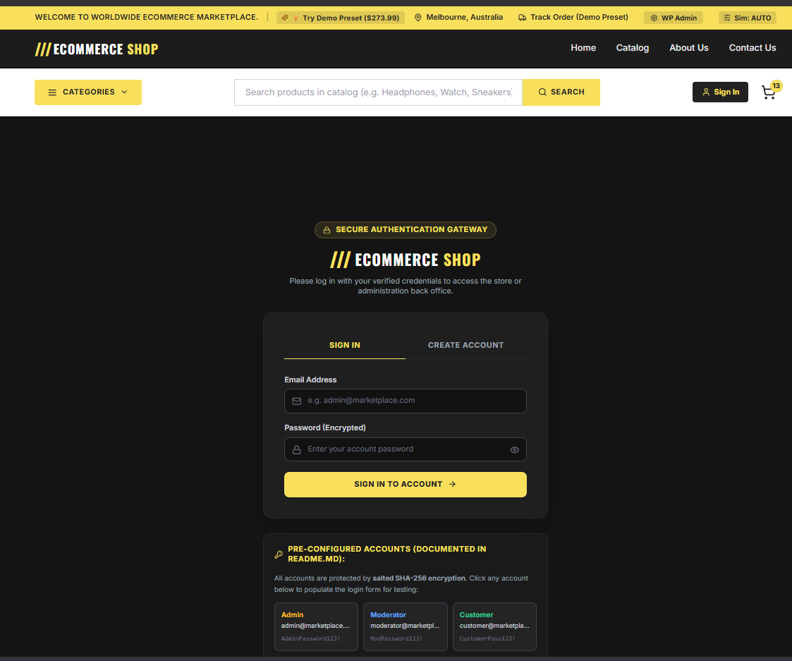
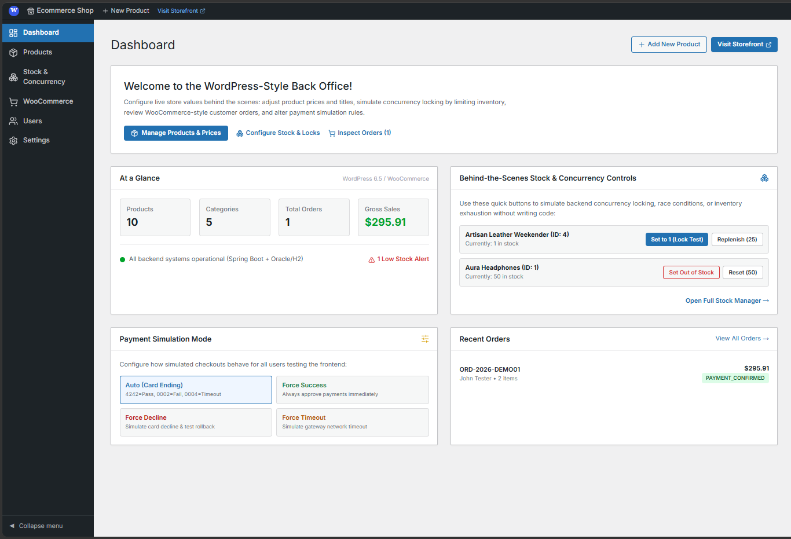
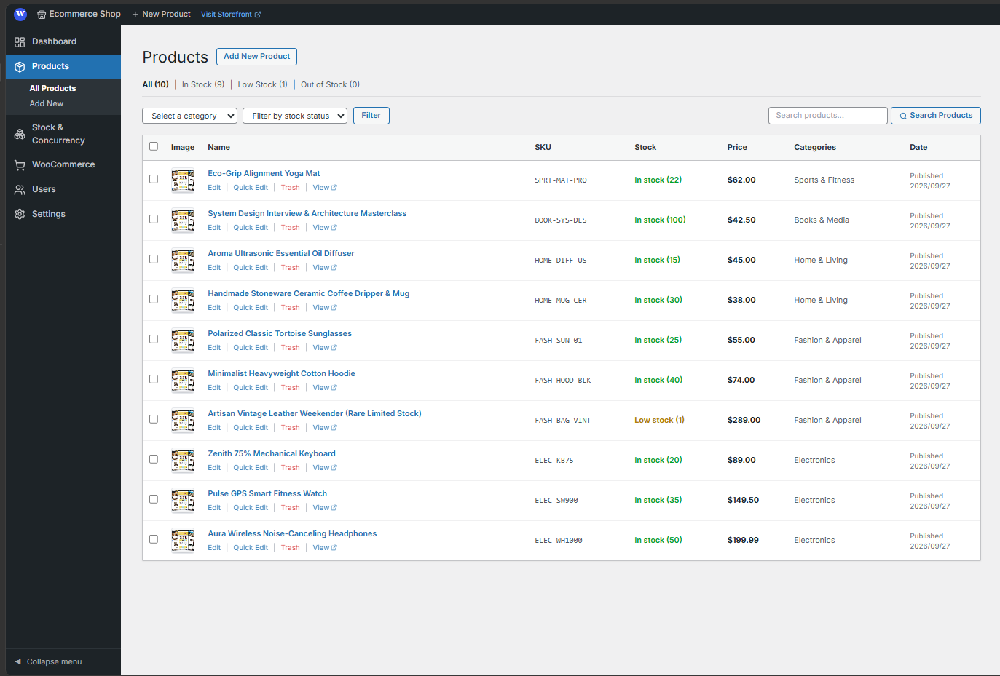
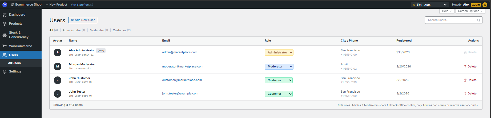
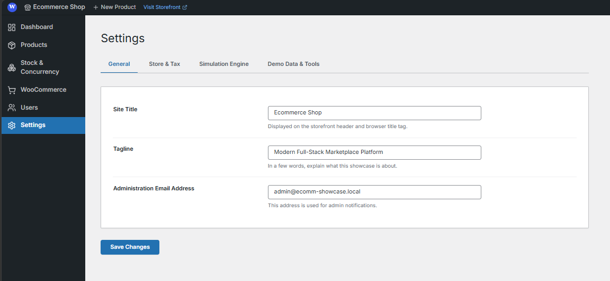

# 🛒 E-Commerce Showcase Platform

[](https://nextjs.org/)
[](https://spring.io/projects/spring-boot)
[](https://www.oracle.com/java/)
[](https://www.typescriptlang.org/)
[](https://www.oracle.com/database/free/)
[](https://flywaydb.org/)
[](https://tailwindcss.com/)

An enterprise-grade, high-fidelity mock e-commerce showcase application designed to demonstrate a complete, production-grade shopping journey. It combines a modern, authentic lifestyle marketplace storefront with a WordPress-style administrative back office and a robust Java Spring Boot 3 backend featuring pessimistic write locking and deterministic transaction simulations.

---

## 📸 Showcase Gallery

Visual demonstration of the application modules, accessible via the curated images in `github_stock/img/`:

### 1. Storefront & Customer Experience

| Public Homepage | Interactive Product Catalog |
| :---: | :---: |
|  |  |
| *Signature dark & market-yellow aesthetic, hero banners, and category selectors.* | *Real-time keyword search, category pills, price range filters, stock indicators, and grid/list toggles.* |

| Product Overview & Inventory | Authentic E-Commerce Brand Story |
| :---: | :---: |
|  |  |
| *Product showcases with stock tracking and fast add-to-cart operations.* | *Authentic brand storytelling: artisanal integrity, sustainable sourcing, and historical milestones.* |

| Customer Support & Concierge | Salted SHA-256 Authentication Gateway |
| :---: | :---: |
|  |  |
| *Direct customer inquiry form with interactive evaluation autofill presets.* | *Mandatory security barrier with Web Crypto salted SHA-256 password encryption.* |

---

### 2. WordPress-Style Administrative Back Office

| Executive Back Office Dashboard | Catalog & Real-Time Stock Control |
| :---: | :---: |
|  |  |
| *Familiar WordPress dashboard (#1d2327) with quick metrics, WooCommerce orders, and help drawers.* | *Full CRUD product management, stock overrides, and concurrency test triggers.* |

| Role-Based User Management (Admin Only) | Store & Gateway Settings |
| :---: | :---: |
|  |  |
| *WordPress `wp-list-table` interface to create, update roles, and safely remove staff/customer accounts.* | *Back-office store configuration, tax rates, currency, and payment simulation toggles.* |

---

## 🌟 Key Architecture & Highlights

### 🛡️ Web Security & Authentication Protocol
- **Mandatory Initial Authentication**: Visitors without an authenticated session are automatically routed to the Authentication Gateway (`/login`) before accessing protected pages.
- **Salted SHA-256 Cryptography**: Passwords are never stored in plaintext. Passwords use 16-byte random cryptographic salts and an application pepper via the browser's native **Web Crypto API** (`crypto.subtle`).
- **Role Isolation & No Hot-Swap**: Fast "role hot-swapping" is strictly disabled. Users must explicitly log out (*"cabut akun"*) before signing in with another role.
- **Three-Tier Permission Hierarchy**:
  - `CUSTOMER`: Public storefront shopping, catalog search, cart drawer, checkout, order history, and personal profile. Clutter-free customer UI with developer/simulation controls hidden.
  - `MODERATOR`: Store operations staff with access to the WordPress Back Office (`/admin`), product catalog, stock adjustments, and WooCommerce orders. Restricted from managing user accounts.
  - `ADMIN`: Platform administrator with full access to the Back Office plus exclusive access to **User Account Management** (`/admin/users`) to create, edit, or delete accounts.

### ⚡ Concurrency & Transactional Reliability
- **Pessimistic Inventory Locking**: Implements database-level `SELECT ... FOR UPDATE` write locks during checkout transactions, mathematically preventing overselling race conditions under high concurrency.
- **Deterministic Payment Simulation**: Configurable tester cards allow testing instant approvals (`4242...`), simulated card declines (`0002...`), or network timeouts (`0004...`).
- **Dual Database Persistence**: Supports enterprise **Oracle Database 23c Free** via Docker, alongside a zero-install embedded **H2 database** in Oracle compatibility mode for instant local development.

---

## 🔑 Pre-Configured Test Credentials

For evaluation and testing, the application includes pre-seeded accounts:

| Role | Email Address | Password | Permissions & Scope |
| :--- | :--- | :--- | :--- |
| **Administrator** | `admin@marketplace.com` | `AdminPassword123!` | Full Back Office (`/admin`), inventory controls, order lifecycle, and **User Management** (`/admin/users`). |
| **Moderator** | `moderator@marketplace.com` | `ModPassword123!` | Full Back Office (`/admin`), product CRUD, and order fulfillment. **Restricted** from managing user accounts. |
| **Customer** | `customer@marketplace.com` | `CustomerPass123!` | Storefront shopping (`/catalog`), cart drawer, checkout, order history, and account profile (`/account`). |
| **Customer (Alt)** | `john.tester@example.com` | `CustomerPass123!` | Secondary customer profile for multi-user order tracking tests. |

---

## ⚙️ System Requirements & Prerequisites

- **Java Development Kit (JDK)**: Version 21 or higher
- **Apache Maven**: Version 3.9+ (or use the project wrapper)
- **Node.js**: Version 18.17+ or 20+
- **npm**: Version 9+
- **Docker & Docker Compose** *(Optional, only if running with real Oracle 23c Free)*

---

## 🚀 Getting Started & Running Locally

### Step 1: Clone the Repository
```bash
git clone https://github.com/your-username/ecomm-showcase.git
cd ecomm-showcase
```

### Step 2: Configure Environment Variables
Copy the template configuration file:
```bash
# Windows (PowerShell)
Copy-Item .env.example .env

# macOS / Linux
cp .env.example .env
```

---

### Step 3: Launch the Application

#### Option A: Zero-Setup Embedded Mode (Fastest & Recommended)
This mode uses the embedded H2 engine in Oracle compatibility mode. No Docker or external database required.

1. **Start the Backend (Terminal 1)**:
   ```bash
   cd backend
   mvn spring-boot:run
   ```
   *The backend will automatically run Flyway migrations, seed demo products, and start at `http://localhost:8080`.*

2. **Start the Frontend (Terminal 2)**:
   ```bash
   cd frontend
   npm install
   npm run dev
   ```
   *The Next.js storefront will boot and be accessible at `http://localhost:3000`.*

---

#### Option B: Running with Real Oracle Database 23c Free (Docker)
1. **Start the Oracle 23c Container**:
   ```bash
   docker compose up -d
   ```
   *Wait approximately 30–60 seconds for the database container to complete its initial health check.*

2. **Start the Backend with the `oracle` Profile**:
   ```bash
   cd backend
   mvn spring-boot:run -Dspring-boot.run.profiles=oracle
   ```

3. **Start the Frontend**:
   ```bash
   cd frontend
   npm install
   npm run dev
   ```

---

## 💻 Importing into IDEs

### IntelliJ IDEA
1. Open IntelliJ IDEA &rarr; **File** &rarr; **Open** &rarr; Select the `ecomm-showcase` folder.
2. IntelliJ will detect `backend/pom.xml`. Right-click `backend/pom.xml` &rarr; **Add as Maven Project**.
3. Set Project SDK to **Java 21** (**File** &rarr; **Project Structure** &rarr; **Project** &rarr; **SDK 21**).
4. For the frontend, open the integrated terminal:
   ```bash
   cd frontend && npm install
   ```
5. Run the backend by opening `backend/src/main/java/.../EcommShowcaseApplication.java` and clicking **Run**.

### Visual Studio Code
1. Open VS Code &rarr; **File** &rarr; **Open Folder** &rarr; Select `ecomm-showcase`.
2. Recommended extensions:
   - **Extension Pack for Java** (`vscjava.vscode-java-pack`)
   - **Spring Boot Extension Pack** (`vmware.vscode-spring-boot-pack`)
   - **ESLint** & **Tailwind CSS IntelliSense**
3. Use the VS Code split terminal:
   - Terminal 1: `cd backend && mvn spring-boot:run`
   - Terminal 2: `cd frontend && npm run dev`

---

## 🔗 Key URLs & Developer Endpoints

| Portal / Resource | URL | Description |
| :--- | :--- | :--- |
| **Public Storefront** | [http://localhost:3000](http://localhost:3000) | Public storefront, interactive catalog, and shopping cart. |
| **Authentication Gateway** | [http://localhost:3000/login](http://localhost:3000/login) | Salted password login and customer account registration. |
| **Customer Account** | [http://localhost:3000/account](http://localhost:3000/account) | Customer profile, shipping addresses, and order history. |
| **WordPress Back Office** | [http://localhost:3000/admin](http://localhost:3000/admin) | Administration dashboard (Moderator & Admin access). |
| **Staff User Manager** | [http://localhost:3000/admin/users](http://localhost:3000/admin/users) | User accounts and role manager (Admin only). |
| **Spring Boot REST API** | [http://localhost:8080/api/v1](http://localhost:8080/api/v1) | Backend REST API root endpoints. |
| **OpenAPI / Swagger UI** | [http://localhost:8080/swagger-ui.html](http://localhost:8080/swagger-ui.html) | Interactive Swagger documentation for all backend endpoints. |
| **H2 Database Console** | [http://localhost:8080/h2-console](http://localhost:8080/h2-console) | In-memory database browser (JDBC: `jdbc:h2:mem:ecommdb`, user: `sa`). |

---

## 🧪 Testing Concurrency & Payment Simulations

### 1. Concurrency & Overselling Protection Test
- In the catalog, locate the **Artisan Vintage Leather Weekender (SKU: `FASH-BAG-VINT`)**, seeded with **only 1 unit in stock**.
- Attempt to order 2 units or check out concurrently across two browser tabs.
- The backend acquires a pessimistic write lock (`SELECT ... FOR UPDATE`), preventing overselling race conditions and returning an explicit HTTP 409 Conflict.

### 2. Simulated Payment Card Gateways
Test payment gateway behaviors during checkout:
- **Card `4242 4242 4242 4242`**: Instant approval with an authoritative transaction reference.
- **Card `4000 0000 0000 0002`**: Simulated card decline (insufficient funds); cart contents are safely preserved.
- **Card `4000 0000 0000 0004`**: Simulated gateway timeout error; supports retry logic.
- **Cash on Delivery (COD)**: Immediately authorized without requiring card details.

---

## 📁 Repository Directory Structure

```
├── .env.example                # Externalized environment variables template
├── .gitignore                  # Global Git ignore rules (OS, IDE, Next.js, Maven, DB)
├── README.md                   # Primary project documentation & showcase guide
├── Plan.md                     # Architecture blueprint and design specifications
├── docker-compose.yml          # Oracle Database 23c Free container definition
├── github_stock/               # High-resolution showcase screenshots for GitHub
│   └── img/                    # UI captures (Home, Catalog, Login, Admin, etc.)
├── backend/                    # Spring Boot 3.3.4 (Java 21) REST Backend
│   ├── .gitignore              # Java & Maven specific ignores
│   ├── pom.xml                 # Maven build configuration & dependencies
│   └── src/main/               # Backend Java source code & Flyway migrations
│       ├── java/.../           # Modular domain packages (catalog, cart, checkout, admin)
│       └── resources/          # Flyway SQL migrations (V1 schema, V2 seed data)
└── frontend/                   # Next.js 14 App Router Frontend
    ├── .gitignore              # Node & Next.js specific ignores
    ├── package.json            # Frontend dependencies & scripts
    ├── tailwind.config.ts      # Tailwind CSS styling design system tokens
    └── src/                    # Frontend source code
        ├── app/                # App Router pages (/catalog, /login, /account, /admin)
        ├── components/         # Reusable UI components & AuthGuard security wrapper
        ├── lib/                # API client, presets, and Web Crypto hashing protocol
        ├── stores/             # Zustand state stores (useCartStore, useAuthStore)
        └── types/              # TypeScript interfaces and domain entity models
```

---

## 📄 License
This project is open-source and available under the [MIT License](LICENSE).
